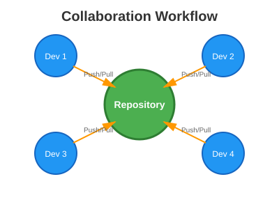

# collaborate
This is a demo repo to collaborate (study purpose)

## Collaboration Workflow

### Image Description

This diagram illustrates a typical collaborative development workflow using a version control system. The central green circle represents the shared repository, while the four blue circles represent individual developers (Dev 1, Dev 2, Dev 3, and Dev 4). The orange arrows indicate the push and pull operations that developers perform to synchronize their work with the central repository. This visual demonstrates how multiple team members can work on the same project simultaneously, contributing their changes and staying updated with the latest codebase through regular interactions with the shared repository.
